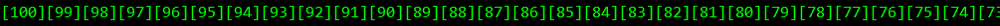
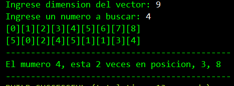
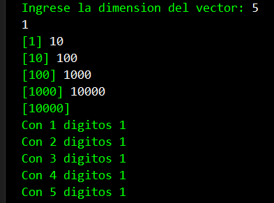
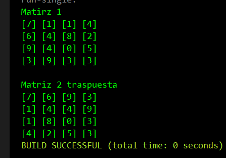
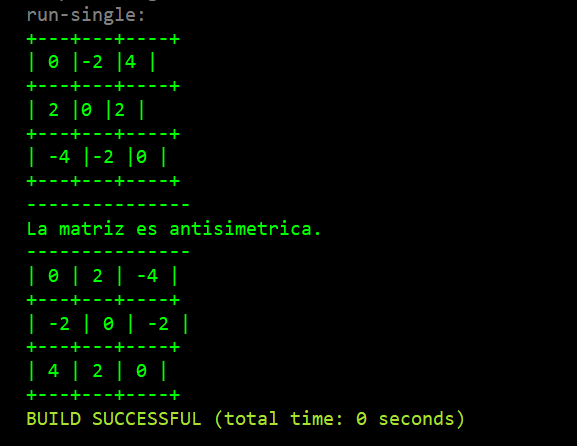
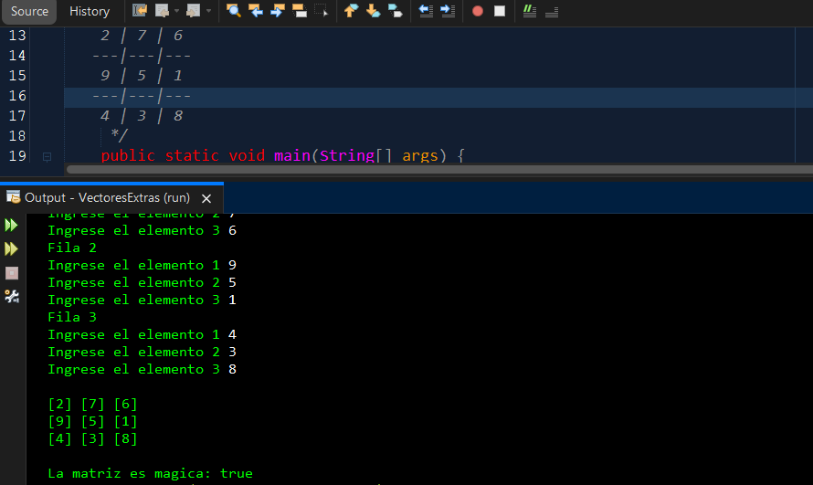

# Argentina Programa 4.0 y EGG - Backend 1: Introducción a Java
## Sitios web
#### Sitio web oficial del Programa Argentina Programa 4.0 y EGG:
URL: https://eggcooperation.com/argentina-programa/

Descripción: Este sitio web es la fuente oficial de información sobre el Programa Argentina Programa 4.0 y EGG. Aquí puedes encontrar información sobre los cursos, incluyendo Backend 1: Introducción a Java.

### Canal de YouTube de EGG:
URL: https://www.youtube.com/channel/UCwvZHQGdV7QIWcS9-rq3cnQ

Descripción: El canal de YouTube de EGG es una fuente de contenido educativo y recursos para programadores. Aquí puedes encontrar videos relacionados con el curso Backend 1: Introducción a Java, así como otros cursos y temas relacionados con programación.

### Página web de Argentina Programa 4.0 sobre programación:
URL: https://www.argentina.gob.ar/economia/conocimiento/argentina-programa/programacion

Descripción: Este es el sitio web oficial del Programa Argentina Programa 4.0, donde puedes encontrar información sobre todos los cursos que ofrecen, incluido el curso Backend 1: Introducción a Java. Aquí puedes encontrar información sobre cómo registrarte y participar en el programa, así como recursos adicionales para programadores.

### Material de estudio
Documento de Google Drive con materiales del curso Backend 1: Introducción a Java:
URL: https://docs.google.com/document/d/168RmjlK4TseICQuOPZbG9F3geRYiHSIG3xCOIQrxCZU/edit

Descripción: Este documento de Google Drive contiene materiales de estudio y recursos para el curso Backend 1: Introducción a Java. Aquí puedes encontrar información sobre conceptos básicos de Java, como variables y tipos de datos, así como estructuras de control de flujo y manejo de excepciones.

### Documento de Google Drive con ejercicios de práctica de Java:
URL: https://docs.google.com/document/d/1pj2XwtSiq5d7_rTMeJLazjj3PWBeGAyKzT9I4gnbHvc/edit

Descripción: Este documento de Google Drive contiene ejercicios de práctica de Java para el curso Backend 1: Introducción a Java. Aquí puedes encontrar problemas para resolver con Java, con el fin de poner en práctica los conceptos aprendidos en el curso.

### Video tutorial sobre vectores en Java:
URL: https://www.youtube.com/watch?v=CKSW8ws8fAU

##### Descripción: Este video tutorial cubre el tema de vectores en Java, que puede ser útil para aquellos que están tomando el curso Backend 1: Introducción a Java y desean profundizar en su conocimiento de Java.

###### Notas personales del estudiante
###### Nombre: Diego Cristian Alfredo Veras

###### Nickname en el curso: DVTecno

###### Descripción: Documentando experiencia en el curso Backend 1: Introducción a Java a través de notas personales, que pueden incluir observaciones, resúmenes y otras reflexiones.

## Table of Contents

1. [Ejercicio 1](#ejercicio-1)
2. [Ejercicio 2](#ejercicio-2)
3. [Ejercicio 3](#ejercicio-3)
4. [Ejercicio 4](#ejercicio-4)
5. [Ejercicio 5](#ejercicio-5)
6. [Ejercicio 6](#ejercicio-6)

$ git clone https://example.com
$ cd ../path/to/the/file
$ npm install
$ npm start

A. [General Info](#general-info)
B. [Technologies](#technologies)
C. [Installation](#installation)
D. [Collaboration](#collaboration)
E. [FAQs](#faqs)

## Ejercicio 1
...

## Ejercicio 1
...
#####1. Realizar un algoritmo que llene un vector con los 100 primeros números
#####enteros y los muestre por pantalla en orden descendente.

### Imagen

1. [Ejercicio 1](https://github.com/DVTecno/VectoresExtras/blob/main/src/vetores/EjAprendizaje/ej1.java)

## Ejercicio 2
...
####2. Realizar un algoritmo que llene un vector de tamaño N con valores
####aleatorios y le pida al usuario un número a buscar en el vector. El
####programa mostrará dónde se encuentra el numero y si se encuentra
####repetido

### Imagen

2. [Ejercicio 2](https://github.com/DVTecno/VectoresExtras/blob/main/src/vetores/EjAprendizaje/ej2.java)

## Ejercicio 3
...

####3.Recorrer un vector de N enteros contabilizando cuántos números son de 1 dígito, 
####cuántos de 2 dígitos, etcétera (hasta 5 dígitos).
### Imagen

3. [Ejercicio 3](https://github.com/DVTecno/VectoresExtras/blob/main/src/vetores/EjAprendizaje/ej3.java)

## Ejercicio 4
...
####4.Realizar un programa que rellene un matriz de 4 x 4 de valores aleatorios y
####muestre la traspuesta de la matriz. La matriz traspuesta de una matriz A
####se denota por B y se obtiene cambiando sus filas por columnas (o viceversa).

### Imagen

4. [Ejercicio 4](https://github.com/DVTecno/VectoresExtras/blob/main/src/vetores/EjAprendizaje/ej4.java)

## Ejercicio 5
...
####5.Realice un programa que compruebe si una matriz dada es antisimétrica.
####Se dice que una matriz A es antisimétrica cuando ésta es igual a su propia traspuesta,
####pero cambiada de signo. Es decir, A es antisimétrica si A = -AT.
####La matriz traspuesta de una matriz A se denota por AT y se obtiene
####cambiando sus filas por columnas (o viceversa).

### Imagen

5. [Ejercicio 5](https://github.com/DVTecno/VectoresExtras/blob/main/src/vetores/EjAprendizaje/Ej5.java)

## Ejercicio 6
...
####6. Un cuadrado mágico 3 x 3 es una matriz 3 x 3 formada por números del 1 al 9
####donde la suma de sus filas, sus columnas y sus diagonales son idénticas.
####Crear un programa que permita introducir un cuadrado por teclado y determine 
####si este cuadrado es mágico o no. El programa deberá comprobar que los números 
####introducidos son correctos, es decir, están entre el 1 y el 9.

### Imagen

6. [Ejercicio 6](https://github.com/DVTecno/VectoresExtras/blob/main/src/vetores/EjAprendizaje/Ej6.java)
